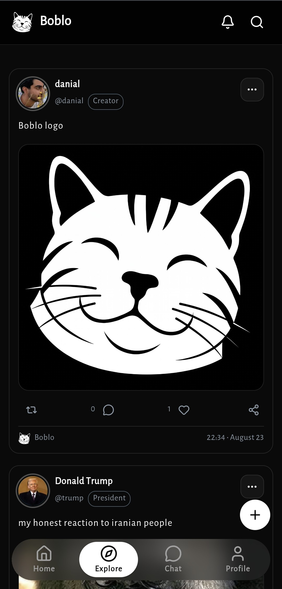

<div align="center">

  

  # Boblo

  **A modern, lightning-fast microblogging and social platform built for meaningful conversations.**

  [](https://nextjs.org/)
  [](https://react.dev/)
  [](https://tanstack.com/query)
  [](https://www.prisma.io/)
  [](https://www.mongodb.com/)
  [](https://tailwindcss.com/)

  Live at: **[boblo.ir](https://boblo.ir)**

  <br />

  

</div>

---

## ✨ Features

- **⚡ Blazing Fast Feeds with TanStack Query v5**
  - **Cursor-based Infinite Scroll:** Smooth, continuous scrolling across Everyone, Following, Profile Posts, Replies, and Retweets without duplicate posts or pagination lag.
  - **Zero-Latency Navigation:** In-memory caching (`staleTime: 60s`) makes switching tabs or pressing the browser "Back" button instantaneous.
  - **Server-Side Hydration:** Initial feed pages are pre-rendered on the server for instant First Contentful Paint (FCP) and full SEO compatibility.
  - **Reactive Cache Invalidation:** Creating or deleting tweets automatically syncs and updates feeds across the app without full page reloads.
  - **Live Notification Polling:** Unread notification count updates in the background every 30 seconds and automatically pauses when tabs are inactive to save battery and data.

- **🛡️ Authentication & Authorization**
  - Powered by **Auth.js (NextAuth v5)** with custom credentials and OAuth support.
  - Secure password hashing via `bcryptjs`.
  - Type-safe session management with Prisma adapter.

- **📱 Progressive Web App (PWA) & Web Push**
  - Fully installable on iOS, Android, macOS, and Windows.
  - Web Push Notifications with custom rounded sender avatars and app badge branding.
  - Offline asset caching via service worker (`/sw.js`).

- **📸 Media & Cloudinary Integration**
  - Secure client-side file upload directly to Cloudinary with automatic dimensions, format transformations, and CDN distribution.
  - Automatic URL sanitization and domain verification.

- **🎨 Sleek Dark-Mode Design System**
  - Handcrafted dark UI styled with **Tailwind CSS v4** and **Base UI**.
  - Smooth fluid micro-interactions with **Motion**.
  - Rich tweet sharing with screenshot generation.

- **🔒 Security & Rate Limiting**
  - Distributed rate limiting powered by **Upstash Redis** to protect against spam, reply floods, and brute-force attacks.

---

## 🛠️ Tech Stack

| Layer | Technology |
|---|---|
| **Framework** | [Next.js 16](https://nextjs.org/) (App Router, Server Actions, Suspense Streaming) |
| **UI Library** | [React 19](https://react.dev/) |
| **State & Query** | [TanStack Query v5](https://tanstack.com/query) & [Zustand](https://zustand-demo.pmnd.rs/) |
| **Database** | [MongoDB Atlas](https://www.mongodb.com/) |
| **ORM** | [Prisma ORM 6](https://www.prisma.io/) |
| **Authentication** | [Auth.js / NextAuth v5](https://authjs.dev/) |
| **Styling** | [Tailwind CSS v4](https://tailwindcss.com/) & [Base UI](https://base-ui.com/) |
| **Rate Limiting** | [Upstash Redis](https://upstash.com/) |
| **Media Hosting** | [Cloudinary](https://cloudinary.com/) |
| **PWA** | [@ducanh2912/next-pwa](https://github.com/DuCanhDe/next-pwa) & Web Push API |

---

## 🚀 Getting Started

### 1. Clone the repository

```bash
git clone https://github.com/DanialZaree/tweeter.git
cd tweeter
```

### 2. Install dependencies

```bash
npm install
```

### 3. Configure environment variables

Create a `.env` file in the root directory:

```env
# Database
MONGODB_URI="mongodb+srv://<user>:<password>@cluster.mongodb.net/tweeter?retryWrites=true&w=majority"

# NextAuth
AUTH_SECRET="your-auth-secret"
NEXT_PUBLIC_APP_URL="http://localhost:3000"

# Cloudinary
CLOUDINARY_CLOUD_NAME="your-cloud-name"
CLOUDINARY_API_KEY="your-api-key"
CLOUDINARY_API_SECRET="your-api-secret"

# Web Push
NEXT_PUBLIC_VAPID_PUBLIC_KEY="your-vapid-public-key"
VAPID_PRIVATE_KEY="your-vapid-private-key"
VAPID_SUBJECT="mailto:support@boblo.ir"

# Upstash Redis (Optional for rate limiting)
UPSTASH_REDIS_REST_URL="your-upstash-url"
UPSTASH_REDIS_REST_TOKEN="your-upstash-token"
```

### 4. Initialize Database

Generate Prisma client:

```bash
npx prisma generate
```

### 5. Run the development server

```bash
npm run dev
```

Open [http://localhost:3000](http://localhost:3000) in your browser.

---

## 📜 Available Scripts

- `npm run dev`: Starts the Next.js development server with Turbopack.
- `npm run build`: Generates the production bundle.
- `npm run start`: Runs the built production server.
- `npm run lint`: Runs ESLint checks.
- `npm run format`: Formats code with Prettier.

---

## 📄 License

This project is licensed under the [MIT License](LICENSE).
