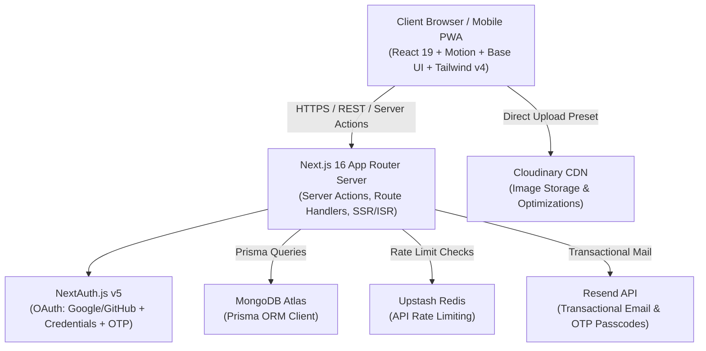
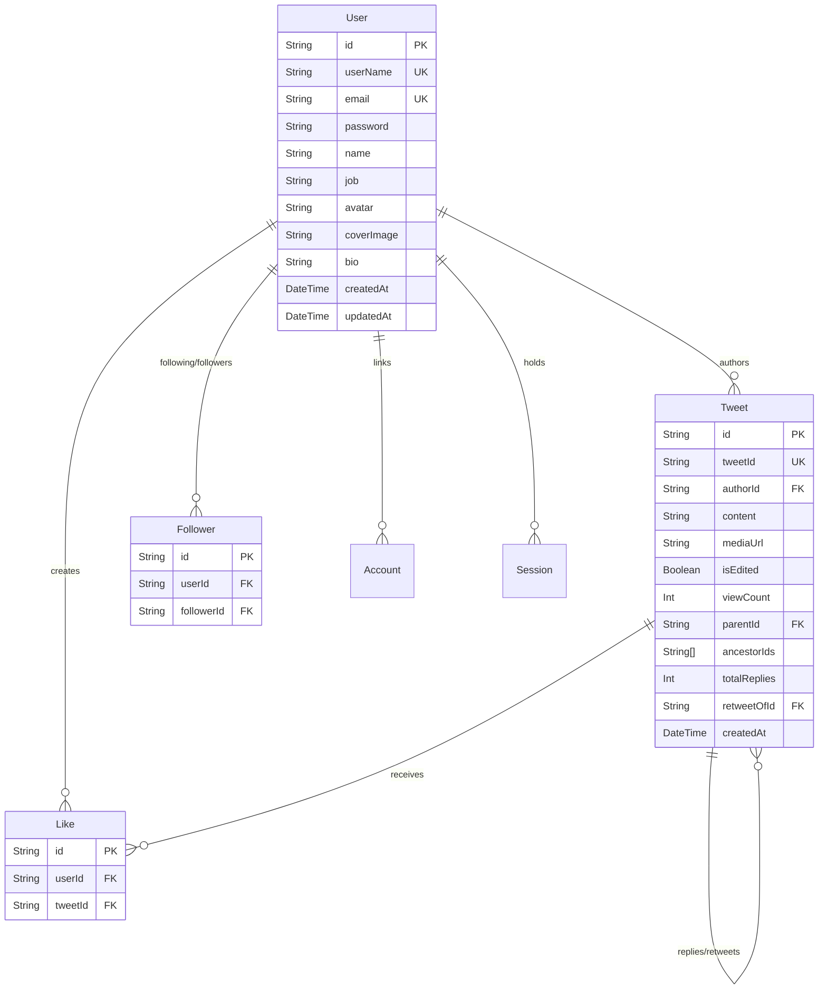

# Boblo — System Design & Architecture Document

> **Product**: Boblo (`https://boblo.ir`)  
> **Tagline**: *"Share your thoughts with the world — Connect and share your thoughts in real time."*  
> **Version**: `0.1.0` (Production-Ready Microblogging Platform & PWA)

---

## 1. Executive Summary & Vision

**Boblo** is a modern, high-performance social microblogging platform designed for seamless real-time conversations, content discovery, and creator networking. Built with a mobile-first philosophy, Boblo combines a sleek obsidian dark-mode design system with fluid spring micro-interactions, full Progressive Web App (PWA) capabilities, and secure full-stack cloud architecture.

### Key Value Propositions
- **Fluid, Native-App Experience**: Zero-latency navigation with floating spring-physics navigation docks, bottom drawer sheets, and offline-capable PWA architecture.
- **Rich Media & Threading**: First-class support for multi-tier reply threads, retweet quotations, high-resolution media previews, and instant screenshot generation for external sharing.
- **Design Excellence**: Deep space-black dark theme, curated status palettes, deterministic generative avatar gradients, and accessible headless UI primitives.
- **Enterprise-Grade Foundation**: Next.js 16 App Router, React 19, MongoDB with Prisma ORM, NextAuth v5, Cloudinary CDN, Upstash Redis rate-limiting, and automated SEO indexing.

---

## 2. Technology Stack & Infrastructure



### Core Technologies

| Layer | Technology | Version / Specification | Purpose |
| :--- | :--- | :--- | :--- |
| **Framework** | Next.js | `^16.2.12` (App Router) | Server components, Server Actions, dynamic routing, metadata API |
| **Frontend Runtime** | React & React DOM | `^19.2.6` | Modern concurrent rendering, `useTransition`, server actions |
| **Language** | TypeScript | `^5.0.0` | End-to-end type safety across schemas, models, and UI props |
| **Styling** | Tailwind CSS & tw-animate-css | `^4.0.0` + `@tailwindcss/postcss` | Theme tokens, modern utility classes, OKLCH color spaces |
| **UI Primitives** | Base UI (`@base-ui/react`) & Shadcn UI | `^1.5.0` | Accessible unstyled headless components (Drawer, Tabs, Forms) |
| **Animations** | Motion (`motion/react`) | `^13.0.0` | Spring physics, floating dock navigation, OTP transitions |
| **Iconography** | Lucide React | `^1.17.0` | Crisp vector icons with stroke-width consistency |
| **State Management**| Zustand | `^5.0.13` | Lightweight modular client stores for drawer, likes, image modal |
| **Database & ORM** | MongoDB + Prisma ORM | `@prisma/client ^6.19.3` | Scalable document store with typed schema relations |
| **Authentication** | NextAuth.js (Auth.js) | `^5.0.0-beta.31` | JWT strategy, Prisma adapter, OAuth (Google/GitHub), Credentials |
| **Media & Storage** | Cloudinary (`next-cloudinary`) | `^6.17.5` | User avatars, cover banners, and tweet attachment hosting |
| **Email Service** | Resend | `^6.18.1` | Automated email OTP verification codes and security notices |
| **Rate Limiting** | Upstash Redis | `@upstash/ratelimit ^2.0.8` | Sliding window rate limiting for auth and post creation |
| **PWA Support** | Next PWA (`@ducanh2912/next-pwa`)| `^10.2.9` | Service worker registration, offline caching, web manifest |
| **Sharing Utility** | Modern Screenshot | `^4.7.0` | Client-side DOM-to-Blob capture for sharing tweet cards |
| **Form Validation** | React Hook Form + Zod | `react-hook-form ^7.72.1`, `zod ^4.3.6` | Strict runtime schema validation and reactive client feedback |

---

## 3. Design System & Visual Aesthetics

### 3.1 Color Palette & Token Architecture

Boblo uses a dark-mode theme rooted in obsidian tones, balanced with vibrant Twitter/Sky-blue accents and accessible contrast ratios.

```
┌────────────────────────────────────────────────────────────────────────┐
│  --color-background       #0B0F14   Deep Obsidian Space Black          │
│  --color-card             #11161D   Elevated Card Background           │
│  --color-surface          #2A2A2A   Interactive Surface / Pill Bg      │
│  --color-surface-2        #4F4F4F   Avatar Ring / Secondary Surface    │
│  --color-surface-hover    #1B222C   Surface Hover State                │
│  --color-border           #8B98A5   Standard Subtle Border             │
│  --color-border-soft      #1C2732   Divider / Card Border              │
├────────────────────────────────────────────────────────────────────────┤
│  --color-primary          #1D9BF0   Boblo Sky Blue (Brand Accent)      │
│  --color-primary-hover    #1A8CD8   Sky Blue Hover State               │
│  --color-primary-soft     #0D3A5A   Translucent Blue Glow              │
├────────────────────────────────────────────────────────────────────────┤
│  --color-foreground       #F7F9F9   Primary High-Contrast Text         │
│  --color-text-muted       #8B98A5   Secondary Metadata Text            │
│  --color-text-subtle      #536471   Tertiary Placeholder / Subtitle    │
├────────────────────────────────────────────────────────────────────────┤
│  --color-success          #00BA7C   Mint Green (Follow, Verify)        │
│  --color-warning          #FFD400   Amber Gold (Alerts, Warnings)      │
│  --color-danger           #F91880   Rose / Hot Pink (Likes, Destructive)│
└────────────────────────────────────────────────────────────────────────┘
```

### 3.2 Generative Avatar & Banner Gradients
When a user does not have an uploaded avatar or cover banner, Boblo deterministically calculates a vibrant dual/tri-tone linear gradient using a string hash of their `userName`:

1. `from-rose-400 via-fuchsia-500 to-indigo-500`
2. `from-cyan-400 via-blue-500 to-indigo-600`
3. `from-emerald-400 via-teal-500 to-cyan-500`
4. `from-violet-500 via-purple-500 to-fuchsia-500`
5. `from-amber-400 via-orange-500 to-rose-500`
6. `from-lime-400 via-emerald-500 to-teal-600`
7. `from-indigo-500 via-purple-500 to-pink-500`
8. `from-yellow-400 via-orange-500 to-red-500`

### 3.3 Typography & Hierarchy
- **Font Stack**: Custom primary local font (`font.ttf`) with fallback to `font-sans` (system sans-serif stack).
- **Scale & Usage**:
  - **Hero / Page Titles**: `text-2xl font-bold tracking-tight text-white`
  - **Author Names**: `text-lg sm:text-[20px] font-extrabold leading-tight`
  - **Usernames / Handles**: `text-xs sm:text-[14px] text-white/50`
  - **Tweet Body Copy**: `text-sm sm:text-[15px] leading-relaxed text-white/90`
  - **Timestamps & Counters**: `text-xs sm:text-[13px] text-white/50`
  - **Button & Tab Labels**: `text-xs sm:text-sm font-semibold tracking-wide`

### 3.4 Spatial System & Layout Constraints
- **Main Frame (`Frame`)**: `max-w-2xl mx-auto px-3 sm:px-6` (Central column optimized for reading density).
- **Tweet Feed (`TweetList`)**: `max-w-xl mx-auto` (Strict optimal reading line-length).
- **Top Sticky Navbar**: `h-14 bg-black/80 backdrop-blur-md border-b border-white/10 px-4 sm:px-6`.
- **Bottom Navigation Safe Zone**: `pb-18` on root layout body to prevent floating docks from obscuring content.

---

## 4. Information Architecture & Navigation

```
                       ┌─────────────────────────┐
                       │       Boblo App         │
                       │    (https://boblo.ir)   │
                       └────────────┬────────────┘
                                    │
    ┌─────────────────┬─────────────┴───────────────┬─────────────────┐
    │                 │                             │                 │
┌───▼───┐         ┌───▼───┐                     ┌───▼───┐         ┌───▼───┐
│ /     │         │/explore│                    │ /chat │         │/profile│
│ Home  │         │Global │                     │Direct │         │User   │
│ Feed  │         │Stream │                     │Inbox  │         │Profile│
└───┬───┘         └───┬───┘                     └───┬───┘         └───┬───┘
    │                 │                             │                 │
    │                 ├──────────────┐              │                 ├──────────────┐
    │                 │              │              │                 │              │
┌───▼───────┐   ┌─────▼─────┐  ┌─────▼─────┐   ┌────▼──────┐   ┌──────▼──────┐ ┌─────▼─────┐
│Install PWA│   │/tweet/[id]│  │New Tweet  │   │Protected  │   │/[username]  │ │/profile/  │
│Banner     │   │Thread View│  │Drawer FAB │   │Sign-In Req│   │Public View  │ │edit Form  │
└───────────┘   └───────────┘  └───────────┘   └───────────┘   └─────────────┘ └───────────┘
                                       │
                               ┌───────▼───────┐
                               │ /auth         │
                               │ SignIn/SignUp │
                               │ (OAuth + OTP) │
                               └───────────────┘
```

### Route Map & Access Rules

| Path | Access Level | Description | Key Components |
| :--- | :--- | :--- | :--- |
| `/` | Public / Hybrid | Home feed for logged-in users; guest greeting & install prompt for guests. | `Navbar`, `Frame`, `InstallPrompt`, `SignInBtn` |
| `/explore` | Public | Real-time global feed of all tweets, retweets, and media. | `TweetList`, `Tweet`, `NewTweet` (FAB), `TweetSkeleton` |
| `/tweet/[tweet]` | Public | Deep thread view with parent context, main tweet, and reply chain. | `Tweet`, `NewTweetForm`, `ImageModal` |
| `/[username]` | Public | Public user profile with cover, avatar, bio, follower count, and post tabs. | `Avatar`, `CoverImage`, `Follow`, `Tabs`, `TweetList` |
| `/profile` | Authenticated | Current user's private profile dashboard. | `Avatar`, `CoverImage`, `Tabs`, `TweetList` |
| `/profile/edit` | Authenticated | Profile customization (name, bio, job, avatar, cover image upload). | `EditProfileForm`, `ProfileImageSection`, `ProfileFormFields` |
| `/chat` | Authenticated | Direct private messaging interface (gated with auth lock screen). | `Navbar`, `Frame`, `SignInBtn` |
| `/auth` | Public | Authentication portal with Sign In, Sign Up, OAuth, and Email OTP verification. | `SignIn`, `SignUp`, `OAuthButtons`, `Otp` |
| `/api/image-proxy`| Internal | Server proxy to bypass CORS restrictions for DOM screenshot generation. | `fetch`, stream pipe |
| `/api/auth/[...]` | Internal | NextAuth.js API route handlers for callbacks and session handling. | `handlers` |

---

## 5. Core Features & Component Specifications

### 5.1 The Tweet Card Ecosystem (`app/components/Tweet/`)
The Tweet card is the core interactive atom of Boblo:
- **Header Section**: Avatar with expandable click-to-zoom modal, author display name, handle, job badge, creation date/time, and optional `isEdited` indicator.
- **Content Area**: Multi-line auto-directional (`dir="auto"`) text rendering, inline media images with eager loading, and nested Quote-Tweet preview cards (`retweetOf`).
- **Action Toolbar**:
  - **Reply Button**: Count badge with direct navigation to thread reply view.
  - **Retweet Button**: Quick retweet trigger opening composer with parent quotation context.
  - **Like Button**: Heart icon with instant optimistic state toggle (`useLikeStore`) and rollback on failure.
  - **Screenshot / Share Action**: Dynamically proxies embedded images, renders DOM-to-Blob at 2x resolution (`modern-screenshot`), and launches native OS Web Share API (`navigator.share`) or downloads `tweet-[id].png`.
  - **Admin / Author Menu**: `MoreTweetButton` dropdown with inline text editing and tweet deletion.

### 5.2 Floating Jelly Tabs Navigation (`components/ui/jelly-tabs.tsx`)
- Fixed bottom dock (`bottom-3 left-1/2 -translate-x-1/2 z-50`).
- Glassmorphic translucent pill styling (`bg-surface/60 backdrop-blur-md shadow-sm`).
- Animated active indicator powered by Motion springs (`stiffness: 400, damping: 25`).
- 4 primary destinations: Home, Explore, Chat, Profile.

### 5.3 Bottom Composer Drawer (`app/components/ui/NewTweet.tsx` & `NewTweetForm`)
- Triggered by floating circular `+` Action Button (`FAB`) at `bottom-20 sm:bottom-6 right-4 sm:right-6`.
- Accessible bottom sheet drawer utilizing `@base-ui/react/drawer` with swipe-to-dismiss gesture physics.
- 500-character limit counter with color-coded circular progress gauge (`CharLimit`).
- Direct image attachment support with Cloudinary integration and preview thumbnail removal.

### 5.4 Authentication & Email OTP System (`app/components/Otp/` & `actionAuth.ts`)
- **OAuth Providers**: One-click authentication with Google and GitHub.
- **Credentials & OTP**:
  1. User enters username, email, and password.
  2. Server generates secure 4/6-digit verification token stored in MongoDB.
  3. Resend dispatches clean HTML transactional email.
  4. Animated digit input (`components/motion/otp-input.tsx`) captures code with shake-on-error and auto-submit on completion.
  5. 60-second countdown cooldown for resending codes.

### 5.5 PWA & Install Experience (`components/InstallPrompt.tsx`)
- Detects standalone mode vs. browser viewport.
- iOS Safari custom instructions drawer ("Tap Share -> Add to Home Screen").
- Android / Desktop Chrome native `beforeinstallprompt` interception with custom modal instructions.

---

## 6. Database Schema & Data Models

Boblo utilizes MongoDB through Prisma Client. The database schema (`prisma/schema.prisma`) enforces relational integrity and efficient nested tree lookups:



### Schema Highlights
1. **Hierarchical Replies & Ancestry**: `parentId`, `ancestorIds` array, and `totalReplies` allow fast traversal of nested conversation trees.
2. **Retweets & Quotes**: `retweetOfId` self-relations enable seamless quoting of original posts while preserving original authorship.
3. **Follower Graph**: Compound unique index on `@@unique([userId, followerId])` prevents duplicate relationships.
4. **Likes**: Compound unique index on `@@unique([userId, tweetId])` enforces atomic single-like constraints.

---

## 7. State Management Architecture

Boblo uses focused, lightweight Zustand stores to keep UI state decoupled and responsive:

| Store Name | File Path | State & Actions | Use Case |
| :--- | :--- | :--- | :--- |
| `useLikeStore` | `app/store/useLikeStore.ts` | `likedTweets`, `likeCounts`, `optimisticToggleLike()`, `revertToggleLike()` | Instant optimistic UI feedback when liking/unliking posts. |
| `useDrawerStore` | `app/store/useDrawerStore.ts` | `isOpen`, `retweetOfId`, `openDrawer()`, `closeDrawer()` | Global control for the new post / retweet composition sheet. |
| `useImageModalStore`| `app/store/useImageModalStore.ts`| `src`, `open(src)`, `close()` | Lightbox preview for avatars, covers, and tweet attachments. |
| `useCharLimitStore` | `app/store/useCharLimitStore.ts` | `count`, `updateChar(count)` | Synchronizes character counter across textareas and toolbar gauges. |

---

## 8. Security, SEO & Performance Engineering

### 8.1 HTTP Security Headers & CSP
Configured in `next.config.ts`:
- **Content-Security-Policy (CSP)**: Whitelists `self`, Cloudinary, GitHub/Google avatars, and Vercel analytics while blocking unauthorized scripts and cross-site framing.
- **HSTS**: `max-age=63072000; includeSubDomains; preload`
- **Clickjacking Protection**: `X-Frame-Options: DENY`
- **MIME Sniffing**: `X-Content-Type-Options: nosniff`
- **Permissions-Policy**: Restricts camera, microphone, and geolocation.

### 8.2 Dynamic SEO & OpenGraph Generation
- **Title Templates**: Dynamic `%s | Boblo` format across all pages.
- **Dynamic Post Cards**: `/tweet/[tweet]` automatically builds OpenGraph and Twitter summary cards with author handles, snippets, and media previews.
- **Sitemap & Robots**:
  - `app/sitemap.ts`: Automatically indexes the top 1,000 active users and tweets with daily/weekly change frequencies.
  - `app/robots.ts`: Disallows private routes (`/profile`, `/profile/edit`, `/chat`, `/api/`) while granting search engines access to public streams.

### 8.3 Performance Optimizations
- **Image Optimization**: Custom remote domain patterns for Cloudinary, Google, and GitHub avatars.
- **Edge Route Cache Control**: Strict `no-store` headers for sensitive auth and profile edit endpoints, combined with `private, no-cache` for live timelines.
- **Image Proxying**: Dedicated caching proxy for cross-origin image sharing to bypass canvas security taint.

---

## 9. Future Roadmap & Extensibility

1. **Real-Time WebSockets / Push Notifications**: Implementation of real-time message exchange and mention notifications via WebSockets or WebPush.
2. **Hashtag & Full-Text Search Engine**: MongoDB Atlas search indexing for tags, keywords, and user discovery.
3. **Bookmarks & Collections**: User-curated saved post folders.
4. **Rich Text & Mentions Parsing**: Automatic linking of `@mentions` and `#hashtags` with hover profile previews.

---

*Document compiled and verified against Boblo codebase.*
