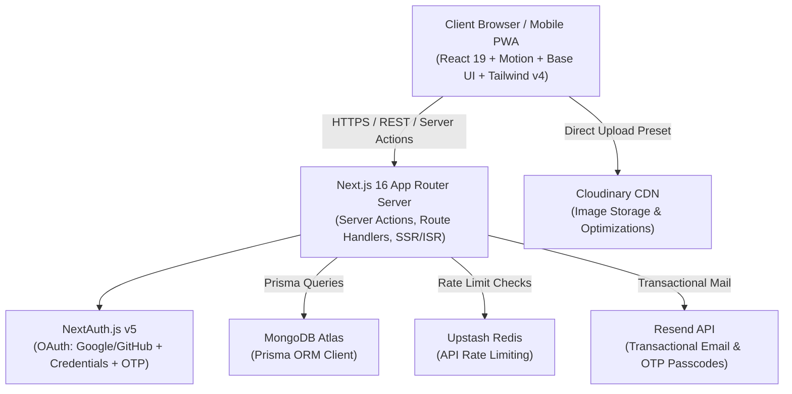
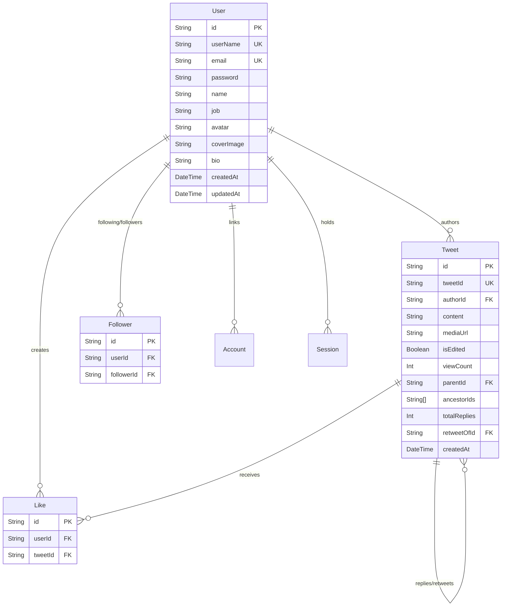

# Boblo — System Design & Architecture Document

> **Product**: Boblo (`https://boblo.ir`)  
> **Tagline**: _"Share your thoughts with the world — Connect and share your thoughts in real time."_  
> **Version**: `0.1.0` (Production-Ready Microblogging Platform & PWA)

---

## 1. Executive Summary & Vision

**Boblo** is a modern, high-performance social microblogging platform designed for seamless real-time conversations, content discovery, and creator networking. Built with a mobile-first philosophy, Boblo combines a sleek obsidian dark-mode design system with fluid spring micro-interactions, full Progressive Web App (PWA) capabilities, and secure full-stack cloud architecture.

### Key Value Propositions

- **Fluid, Native-App Experience**: Zero-latency navigation with floating spring-physics navigation docks, bottom drawer sheets, and offline-capable PWA architecture.
- **Rich Media & Threading**: First-class support for multi-tier reply threads, retweet quotations, high-resolution media previews, and instant screenshot generation for external sharing.
- **Design Excellence**: Deep space-black dark theme, curated status palettes, deterministic generative avatar gradients, and accessible headless UI primitives.
- **Enterprise-Grade Foundation**: Next.js 16 App Router, React 19, MongoDB with Prisma ORM, NextAuth v5, Cloudinary CDN, Upstash Redis rate-limiting, and automated SEO indexing.

---

## 2. Technology Stack & Infrastructure



### Core Technologies

| Layer                | Technology                             | Version / Specification                 | Purpose                                                          |
| :------------------- | :------------------------------------- | :-------------------------------------- | :--------------------------------------------------------------- |
| **Framework**        | Next.js                                | `^16.2.12` (App Router)                 | Server components, Server Actions, dynamic routing, metadata API |
| **Frontend Runtime** | React & React DOM                      | `^19.2.6`                               | Modern concurrent rendering, `useTransition`, server actions     |
| **Language**         | TypeScript                             | `^5.0.0`                                | End-to-end type safety across schemas, models, and UI props      |
| **Styling**          | Tailwind CSS & tw-animate-css          | `^4.0.0` + `@tailwindcss/postcss`       | Theme tokens, modern utility classes, OKLCH color spaces         |
| **UI Primitives**    | Base UI (`@base-ui/react`) & Shadcn UI | `^1.5.0`                                | Accessible unstyled headless components (Drawer, Tabs, Forms)    |
| **Animations**       | Motion (`motion/react`)                | `^13.0.0`                               | Spring physics, floating dock navigation, OTP transitions        |
| **Iconography**      | Lucide React                           | `^1.17.0`                               | Crisp vector icons with stroke-width consistency                 |
| **State Management** | Zustand                                | `^5.0.13`                               | Lightweight modular client stores for drawer, likes, image modal |
| **Database & ORM**   | MongoDB + Prisma ORM                   | `@prisma/client ^6.19.3`                | Scalable document store with typed schema relations              |
| **Authentication**   | NextAuth.js (Auth.js)                  | `^5.0.0-beta.31`                        | JWT strategy, Prisma adapter, OAuth (Google/GitHub), Credentials |
| **Media & Storage**  | Cloudinary (`next-cloudinary`)         | `^6.17.5`                               | User avatars, cover banners, and tweet attachment hosting        |
| **Email Service**    | Resend                                 | `^6.18.1`                               | Automated email OTP verification codes and security notices      |
| **Rate Limiting**    | Upstash Redis                          | `@upstash/ratelimit ^2.0.8`             | Sliding window rate limiting for auth and post creation          |
| **PWA Support**      | Next PWA (`@ducanh2912/next-pwa`)      | `^10.2.9`                               | Service worker registration, offline caching, web manifest       |
| **Sharing Utility**  | Modern Screenshot                      | `^4.7.0`                                | Client-side DOM-to-Blob capture for sharing tweet cards          |
| **Form Validation**  | React Hook Form + Zod                  | `react-hook-form ^7.72.1`, `zod ^4.3.6` | Strict runtime schema validation and reactive client feedback    |

---

## 3. Design System & Visual Aesthetics

### 3.1 Color Palette & Token Architecture

Boblo uses a dark-mode theme rooted in obsidian tones, balanced with vibrant Twitter/Sky-blue accents and accessible contrast ratios.

```
┌────────────────────────────────────────────────────────────────────────┐
│  --color-background       #0B0F14   Deep Obsidian Space Black          │
│  --color-card             #11161D   Elevated Card Background           │
│  --color-surface          #2A2A2A   Interactive Surface / Pill Bg      │
│  --color-surface-2        #4F4F4F   Avatar Ring / Secondary Surface    │
│  --color-surface-hover    #1B222C   Surface Hover State                │
│  --color-border           #8B98A5   Standard Subtle Border             │
│  --color-border-soft      #1C2732   Divider / Card Border              │
├────────────────────────────────────────────────────────────────────────┤
│  --color-primary          #1D9BF0   Boblo Sky Blue (Brand Accent)      │
│  --color-primary-hover    #1A8CD8   Sky Blue Hover State               │
│  --color-primary-soft     #0D3A5A   Translucent Blue Glow              │
├────────────────────────────────────────────────────────────────────────┤
│  --color-foreground       #F7F9F9   Primary High-Contrast Text         │
│  --color-text-muted       #8B98A5   Secondary Metadata Text            │
│  --color-text-subtle      #536471   Tertiary Placeholder / Subtitle    │
├────────────────────────────────────────────────────────────────────────┤
│  --color-success          #00BA7C   Mint Green (Follow, Verify)        │
│  --color-warning          #FFD400   Amber Gold (Alerts, Warnings)      │
│  --color-danger           #F91880   Rose / Hot Pink (Likes, Destructive)│
└────────────────────────────────────────────────────────────────────────┘
```

### 3.2 Generative Avatar & Banner Gradients

When a user does not have an uploaded avatar or cover banner, Boblo deterministically calculates a vibrant dual/tri-tone linear gradient using a string hash of their `userName`:

1. `from-rose-400 via-fuchsia-500 to-indigo-500`
2. `from-cyan-400 via-blue-500 to-indigo-600`
3. `from-emerald-400 via-teal-500 to-cyan-500`
4. `from-violet-500 via-purple-500 to-fuchsia-500`
5. `from-amber-400 via-orange-500 to-rose-500`
6. `from-lime-400 via-emerald-500 to-teal-600`
7. `from-indigo-500 via-purple-500 to-pink-500`
8. `from-yellow-400 via-orange-500 to-red-500`

### 3.3 Typography & Hierarchy

- **Font Stack**: Custom primary local font (`font.ttf`) with fallback to `font-sans` (system sans-serif stack).
- **Scale & Usage**:
  - **Hero / Page Titles**: `text-2xl font-bold tracking-tight text-white`
  - **Author Names**: `text-lg sm:text-[20px] font-extrabold leading-tight`
  - **Usernames / Handles**: `text-xs sm:text-[14px] text-white/50`
  - **Tweet Body Copy**: `text-sm sm:text-[15px] leading-relaxed text-white/90`
  - **Timestamps & Counters**: `text-xs sm:text-[13px] text-white/50`
  - **Button & Tab Labels**: `text-xs sm:text-sm font-semibold tracking-wide`

### 3.4 Spatial System & Layout Constraints

- **Main Frame (`Frame`)**: `max-w-2xl mx-auto px-3 sm:px-6` (Central column optimized for reading density).
- **Tweet Feed (`TweetList`)**: `max-w-xl mx-auto` (Strict optimal reading line-length).
- **Top Sticky Navbar**: `h-14 bg-black/80 backdrop-blur-md border-b border-white/10 px-4 sm:px-6`.
- **Bottom Navigation Safe Zone**: `pb-18` on root layout body to prevent floating docks from obscuring content.

---

## 4. Information Architecture & Navigation

```
                       ┌─────────────────────────┐
                       │       Boblo App         │
                       │    (https://boblo.ir)   │
                       └────────────┬────────────┘
                                    │
    ┌─────────────────┬─────────────┴───────────────┬─────────────────┐
    │                 │                             │                 │
┌───▼───┐         ┌───▼───┐                     ┌───▼───┐         ┌───▼───┐
│ /     │         │/explore│                    │ /chat │         │/profile│
│ Home  │         │Global │                     │Direct │         │User   │
│ Feed  │         │Stream │                     │Inbox  │         │Profile│
└───┬───┘         └───┬───┘                     └───┬───┘         └───┬───┘
    │                 │                             │                 │
    │                 ├──────────────┐              │                 ├──────────────┐
    │                 │              │              │                 │              │
┌───▼───────┐   ┌─────▼─────┐  ┌─────▼─────┐   ┌────▼──────┐   ┌──────▼──────┐ ┌─────▼─────┐
│Install PWA│   │/tweet/[id]│  │New Tweet  │   │Protected  │   │/[username]  │ │/profile/  │
│Banner     │   │Thread View│  │Drawer FAB │   │Sign-In Req│   │Public View  │ │edit Form  │
└───────────┘   └───────────┘  └───────────┘   └───────────┘   └─────────────┘ └───────────┘
                                       │
                               ┌───────▼───────┐
                               │ /auth         │
                               │ SignIn/SignUp │
                               │ (OAuth + OTP) │
                               └───────────────┘
```

### Route Map & Access Rules

| Path               | Access Level    | Description                                                                     | Key Components                                                |
| :----------------- | :-------------- | :------------------------------------------------------------------------------ | :------------------------------------------------------------ |
| `/`                | Public / Hybrid | Home feed for logged-in users; guest greeting & install prompt for guests.      | `Navbar`, `Frame`, `InstallPrompt`, `SignInBtn`               |
| `/explore`         | Public          | Real-time global feed of all tweets, retweets, and media.                       | `TweetList`, `Tweet`, `NewTweet` (FAB), `TweetSkeleton`       |
| `/tweet/[tweet]`   | Public          | Deep thread view with parent context, main tweet, and reply chain.              | `Tweet`, `NewTweetForm`, `ImageModal`                         |
| `/[username]`      | Public          | Public user profile with cover, avatar, bio, follower count, and post tabs.     | `Avatar`, `CoverImage`, `Follow`, `Tabs`, `TweetList`         |
| `/profile`         | Authenticated   | Current user's private profile dashboard.                                       | `Avatar`, `CoverImage`, `Tabs`, `TweetList`                   |
| `/profile/edit`    | Authenticated   | Profile customization (name, bio, job, avatar, cover image upload).             | `EditProfileForm`, `ProfileImageSection`, `ProfileFormFields` |
| `/chat`            | Authenticated   | Direct private messaging interface (gated with auth lock screen).               | `Navbar`, `Frame`, `SignInBtn`                                |
| `/auth`            | Public          | Authentication portal with Sign In, Sign Up, OAuth, and Email OTP verification. | `SignIn`, `SignUp`, `OAuthButtons`, `Otp`                     |
| `/api/image-proxy` | Internal        | Server proxy to bypass CORS restrictions for DOM screenshot generation.         | `fetch`, stream pipe                                          |
| `/api/auth/[...]`  | Internal        | NextAuth.js API route handlers for callbacks and session handling.              | `handlers`                                                    |

---

## 5. Core Features & Component Specifications

### 5.1 The Tweet Card Ecosystem (`app/components/Tweet/`)

The Tweet card is the core interactive atom of Boblo:

- **Header Section**: Avatar with expandable click-to-zoom modal, author display name, handle, job badge, creation date/time, and optional `isEdited` indicator.
- **Content Area**: Multi-line auto-directional (`dir="auto"`) text rendering, inline media images with eager loading, and nested Quote-Tweet preview cards (`retweetOf`).
- **Action Toolbar**:
  - **Reply Button**: Count badge with direct navigation to thread reply view.
  - **Retweet Button**: Quick retweet trigger opening composer with parent quotation context.
  - **Like Button**: Heart icon with instant optimistic state toggle (`useLikeStore`) and rollback on failure.
  - **Screenshot / Share Action**: Dynamically proxies embedded images, renders DOM-to-Blob at 2x resolution (`modern-screenshot`), and launches native OS Web Share API (`navigator.share`) or downloads `tweet-[id].png`.
  - **Admin / Author Menu**: `MoreTweetButton` dropdown with inline text editing and tweet deletion.

### 5.2 Floating Jelly Tabs Navigation (`components/ui/jelly-tabs.tsx`)

- Fixed bottom dock (`bottom-3 left-1/2 -translate-x-1/2 z-50`).
- Glassmorphic translucent pill styling (`bg-surface/60 backdrop-blur-md shadow-sm`).
- Animated active indicator powered by Motion springs (`stiffness: 400, damping: 25`).
- 4 primary destinations: Home, Explore, Chat, Profile.

### 5.3 Bottom Composer Drawer (`app/components/ui/NewTweet.tsx` & `NewTweetForm`)

- Triggered by floating circular `+` Action Button (`FAB`) at `bottom-20 sm:bottom-6 right-4 sm:right-6`.
- Accessible bottom sheet drawer utilizing `@base-ui/react/drawer` with swipe-to-dismiss gesture physics.
- 500-character limit counter with color-coded circular progress gauge (`CharLimit`).
- Direct image attachment support with Cloudinary integration and preview thumbnail removal.

### 5.4 Authentication & Email OTP System (`app/components/Otp/` & `actionAuth.ts`)

- **OAuth Providers**: One-click authentication with Google and GitHub.
- **Credentials & OTP**:
  1. User enters username, email, and password.
  2. Server generates secure 4/6-digit verification token stored in MongoDB.
  3. Resend dispatches clean HTML transactional email.
  4. Animated digit input (`components/motion/otp-input.tsx`) captures code with shake-on-error and auto-submit on completion.
  5. 60-second countdown cooldown for resending codes.

### 5.5 PWA & Install Experience (`components/InstallPrompt.tsx`)

- Detects standalone mode vs. browser viewport.
- iOS Safari custom instructions drawer ("Tap Share -> Add to Home Screen").
- Android / Desktop Chrome native `beforeinstallprompt` interception with custom modal instructions.

---

## 6. Database Schema & Data Models

Boblo utilizes MongoDB through Prisma Client. The database schema (`prisma/schema.prisma`) enforces relational integrity and efficient nested tree lookups:



### Schema Highlights

1. **Hierarchical Replies & Ancestry**: `parentId`, `ancestorIds` array, and `totalReplies` allow fast traversal of nested conversation trees.
2. **Retweets & Quotes**: `retweetOfId` self-relations enable seamless quoting of original posts while preserving original authorship.
3. **Follower Graph**: Compound unique index on `@@unique([userId, followerId])` prevents duplicate relationships.
4. **Likes**: Compound unique index on `@@unique([userId, tweetId])` enforces atomic single-like constraints.

---

## 7. State Management Architecture

Boblo uses focused, lightweight Zustand stores to keep UI state decoupled and responsive:

| Store Name           | File Path                         | State & Actions                                                             | Use Case                                                            |
| :------------------- | :-------------------------------- | :-------------------------------------------------------------------------- | :------------------------------------------------------------------ |
| `useLikeStore`       | `app/store/useLikeStore.ts`       | `likedTweets`, `likeCounts`, `optimisticToggleLike()`, `revertToggleLike()` | Instant optimistic UI feedback when liking/unliking posts.          |
| `useDrawerStore`     | `app/store/useDrawerStore.ts`     | `isOpen`, `retweetOfId`, `openDrawer()`, `closeDrawer()`                    | Global control for the new post / retweet composition sheet.        |
| `useImageModalStore` | `app/store/useImageModalStore.ts` | `src`, `open(src)`, `close()`                                               | Lightbox preview for avatars, covers, and tweet attachments.        |
| `useCharLimitStore`  | `app/store/useCharLimitStore.ts`  | `count`, `updateChar(count)`                                                | Synchronizes character counter across textareas and toolbar gauges. |

---

## 8. Security, SEO & Performance Engineering

### 8.1 HTTP Security Headers & CSP

Configured in `next.config.ts`:

- **Content-Security-Policy (CSP)**: Whitelists `self`, Cloudinary, GitHub/Google avatars, and Vercel analytics while blocking unauthorized scripts and cross-site framing.
- **HSTS**: `max-age=63072000; includeSubDomains; preload`
- **Clickjacking Protection**: `X-Frame-Options: DENY`
- **MIME Sniffing**: `X-Content-Type-Options: nosniff`
- **Permissions-Policy**: Restricts camera, microphone, and geolocation.

### 8.2 Dynamic SEO & OpenGraph Generation

- **Title Templates**: Dynamic `%s | Boblo` format across all pages.
- **Dynamic Post Cards**: `/tweet/[tweet]` automatically builds OpenGraph and Twitter summary cards with author handles, snippets, and media previews.
- **Sitemap & Robots**:
  - `app/sitemap.ts`: Automatically indexes the top 1,000 active users and tweets with daily/weekly change frequencies.
  - `app/robots.ts`: Disallows private routes (`/profile`, `/profile/edit`, `/chat`, `/api/`) while granting search engines access to public streams.

### 8.3 Performance Optimizations

- **Image Optimization**: Custom remote domain patterns for Cloudinary, Google, and GitHub avatars.
- **Edge Route Cache Control**: Strict `no-store` headers for sensitive auth and profile edit endpoints, combined with `private, no-cache` for live timelines.
- **Image Proxying**: Dedicated caching proxy for cross-origin image sharing to bypass canvas security taint.

---

## 9. Future Roadmap & Extensibility

1. **Real-Time WebSockets / Push Notifications**: Implementation of real-time message exchange and mention notifications via WebSockets or WebPush.
2. **Hashtag & Full-Text Search Engine**: MongoDB Atlas search indexing for tags, keywords, and user discovery.
3. **Bookmarks & Collections**: User-curated saved post folders.
4. **Rich Text & Mentions Parsing**: Automatic linking of `@mentions` and `#hashtags` with hover profile previews.

---

_Document compiled and verified against Boblo codebase._

Viewed schema.prisma:1-130
Viewed page.tsx:1-58
Viewed package.json:1-65
Listed directory ui
Viewed Avatar.tsx:1-65
Viewed index.tsx:1-10
Searched for "formatDate"
Viewed index.tsx:1-60
Searched for "createdAt"
Listed directory lib
Viewed utils.ts:1-7

Here is the complete, production-ready code for your notification system. You can copy and paste these directly into their respective files.

---

### 1. `app/lib/actions/actionNotif.ts`

[actionNotif.ts](file:///c:/Users/dani1/tweeter/app/lib/actions/actionNotif.ts)

```typescript
'use server';

import prisma from '../prisma';
import { auth } from '@/app/auth';
import { revalidatePath } from 'next/cache';

const safeSenderSelect = {
  id: true,
  name: true,
  userName: true,
  avatar: true,
  image: true,
};

export async function getNotif() {
  try {
    const session = await auth();
    const userId = session?.user?.id;

    if (!userId) {
      return { success: false, error: 'Unauthorized', notifications: [], unreadCount: 0 };
    }

    const [notifications, unreadCount] = await Promise.all([
      prisma.notification.findMany({
        where: {
          recipientId: userId,
        },
        orderBy: {
          createdAt: 'desc',
        },
        include: {
          sender: {
            select: safeSenderSelect,
          },
          tweet: {
            select: {
              id: true,
              tweetId: true,
              content: true,
              mediaUrl: true,
            },
          },
        },
      }),
      prisma.notification.count({
        where: {
          recipientId: userId,
          isRead: false,
        },
      }),
    ]);

    return {
      success: true,
      notifications,
      unreadCount,
    };
  } catch (error) {
    console.error('Error fetching notifications:', error);
    return {
      success: false,
      error: 'Failed to fetch notifications',
      notifications: [],
      unreadCount: 0,
    };
  }
}

export async function getUnreadNotificationCount() {
  try {
    const session = await auth();
    const userId = session?.user?.id;

    if (!userId) return 0;

    return await prisma.notification.count({
      where: {
        recipientId: userId,
        isRead: false,
      },
    });
  } catch (error) {
    console.error('Error getting unread count:', error);
    return 0;
  }
}

export async function markNotificationAsRead(id: string) {
  try {
    const session = await auth();
    const userId = session?.user?.id;

    if (!userId) {
      return { success: false, error: 'Unauthorized' };
    }

    await prisma.notification.updateMany({
      where: {
        id,
        recipientId: userId,
      },
      data: {
        isRead: true,
      },
    });

    revalidatePath('/notifications');
    return { success: true };
  } catch (error) {
    console.error('Error marking notification as read:', error);
    return { success: false, error: 'Failed to update notification' };
  }
}

export async function markAllNotificationsAsRead() {
  try {
    const session = await auth();
    const userId = session?.user?.id;

    if (!userId) {
      return { success: false, error: 'Unauthorized' };
    }

    await prisma.notification.updateMany({
      where: {
        recipientId: userId,
        isRead: false,
      },
      data: {
        isRead: true,
      },
    });

    revalidatePath('/notifications');
    return { success: true };
  } catch (error) {
    console.error('Error marking all notifications as read:', error);
    return { success: false, error: 'Failed to update notifications' };
  }
}

export async function deleteNotification(id: string) {
  try {
    const session = await auth();
    const userId = session?.user?.id;

    if (!userId) {
      return { success: false, error: 'Unauthorized' };
    }

    await prisma.notification.deleteMany({
      where: {
        id,
        recipientId: userId,
      },
    });

    revalidatePath('/notifications');
    return { success: true };
  } catch (error) {
    console.error('Error deleting notification:', error);
    return { success: false, error: 'Failed to delete notification' };
  }
}

export async function clearAllNotifications() {
  try {
    const session = await auth();
    const userId = session?.user?.id;

    if (!userId) {
      return { success: false, error: 'Unauthorized' };
    }

    await prisma.notification.deleteMany({
      where: {
        recipientId: userId,
      },
    });

    revalidatePath('/notifications');
    return { success: true };
  } catch (error) {
    console.error('Error clearing notifications:', error);
    return { success: false, error: 'Failed to clear notifications' };
  }
}
```

---

### 2. `app/lib/actions/actionLike.ts`

[actionLike.ts](file:///c:/Users/dani1/tweeter/app/lib/actions/actionLike.ts)

```typescript
'use server';

import prisma from '../prisma';
import { revalidatePath } from 'next/cache';
import { auth } from '@/app/auth';
import { checkRateLimit } from '@/app/lib/ratelimit';

export async function toggleTweetLike(tweetId: string) {
  try {
    const session = await auth();
    const userId = session?.user?.id;

    if (!userId) {
      return { success: false, error: 'Unauthorized' };
    }

    const rateCheck = await checkRateLimit(`like:${userId}`, 30, 60);
    if (!rateCheck.success) {
      return {
        success: false,
        error: rateCheck.error || 'Rate limit exceeded. Please wait a bit.',
      };
    }

    const tweet = await prisma.tweet.findUnique({
      where: { id: tweetId },
      select: { authorId: true },
    });

    if (!tweet) {
      return { success: false, error: 'Tweet not found' };
    }

    const existingLike = await prisma.like.findUnique({
      where: {
        userId_tweetId: {
          userId: userId,
          tweetId: tweetId,
        },
      },
    });

    if (existingLike) {
      // 1. Remove like
      await prisma.like.delete({
        where: {
          userId_tweetId: {
            userId: userId,
            tweetId: tweetId,
          },
        },
      });

      // 2. Remove notification if it exists
      await prisma.notification.deleteMany({
        where: {
          recipientId: tweet.authorId,
          senderId: userId,
          tweetId: tweetId,
          type: 'LIKE',
        },
      });
    } else {
      // 1. Create like
      await prisma.like.create({
        data: {
          userId: userId,
          tweetId: tweetId,
        },
      });

      // 2. Create notification (only if not self-like)
      if (tweet.authorId !== userId) {
        await prisma.notification.create({
          data: {
            recipientId: tweet.authorId,
            senderId: userId,
            type: 'LIKE',
            tweetId: tweetId,
          },
        });
      }
    }

    revalidatePath('/', 'layout');
    revalidatePath('/notifications');
    return { success: true };
  } catch (error) {
    console.error('Error toggling like:', error);
    return { success: false, error: 'Something went wrong' };
  }
}
```

---

### 3. `app/lib/actions/actionFollow.ts`

[actionFollow.ts](file:///c:/Users/dani1/tweeter/app/lib/actions/actionFollow.ts)

```typescript
'use server';

import { auth } from '@/app/auth';
import prisma from '../prisma';
import { revalidatePath } from 'next/cache';
import { checkRateLimit } from '@/app/lib/ratelimit';

export async function followUser(targetUserId: string) {
  const session = await auth();
  const currentUserId = session?.user?.id;

  if (!currentUserId) {
    return { error: 'Unauthorized' };
  }

  const rateCheck = await checkRateLimit(`follow:${currentUserId}`, 20, 60);
  if (!rateCheck.success) {
    return { error: rateCheck.error || 'Rate limit exceeded. Please wait a bit.' };
  }

  if (targetUserId === currentUserId) {
    return { error: 'You cannot follow yourself' };
  }

  try {
    const existingFollow = await prisma.follower.findUnique({
      where: {
        userId_followerId: {
          userId: targetUserId,
          followerId: currentUserId,
        },
      },
      select: { id: true },
    });

    const isCurrentlyFollowing = !!existingFollow;

    if (existingFollow) {
      // 1. Unfollow
      await prisma.follower.delete({
        where: {
          userId_followerId: {
            userId: targetUserId,
            followerId: currentUserId,
          },
        },
      });

      // 2. Delete follow notification
      await prisma.notification.deleteMany({
        where: {
          recipientId: targetUserId,
          senderId: currentUserId,
          type: 'FOLLOW',
        },
      });
    } else {
      // 1. Follow
      await prisma.follower.create({
        data: {
          userId: targetUserId,
          followerId: currentUserId,
        },
      });

      // 2. Create follow notification
      await prisma.notification.create({
        data: {
          recipientId: targetUserId,
          senderId: currentUserId,
          type: 'FOLLOW',
        },
      });
    }

    const targetUser = await prisma.user.findUnique({
      where: { id: targetUserId },
      select: { userName: true },
    });

    if (targetUser?.userName) {
      revalidatePath(`/${targetUser.userName}`);
    }
    revalidatePath('/');
    revalidatePath('/notifications');

    return {
      success: true,
      followerId: currentUserId,
      isFollowing: !isCurrentlyFollowing,
    };
  } catch (e) {
    console.error('Error toggling follow status:', e);
    return { error: 'Failed to update follow status. Please try again.' };
  }
}
```

---

### 4. `app/lib/actions/tweet.ts` (Reply & Retweet triggers)

[tweet.ts](file:///c:/Users/dani1/tweeter/app/lib/actions/tweet.ts)

Update the `createTweet` and `createReply` functions inside `tweet.ts`:

#### In `createTweet`:

```typescript
const tweet = await prisma.tweet.create({
  data: {
    authorId: authorId,
    tweetId: newTweetId,
    content: content,
    retweetOfId: retweetOfId,
    mediaUrl: validatedMediaUrl,
    parentId: null,
    ancestorIds: [],
    createdAt: new Date(),
  },
});

// Create RETWEET notification if this is a quote / retweet
if (retweetOfId) {
  const originalTweet = await prisma.tweet.findUnique({
    where: { id: retweetOfId },
    select: { authorId: true },
  });

  if (originalTweet && originalTweet.authorId !== authorId) {
    await prisma.notification.create({
      data: {
        recipientId: originalTweet.authorId,
        senderId: authorId,
        type: 'RETWEET',
        tweetId: tweet.id,
      },
    });
  }
}

revalidatePath('/', 'layout');
revalidatePath('/notifications');
return { success: true, tweet };
```

#### In `createReply`:

```typescript
const parentTweet = await prisma.tweet.findUnique({
  where: { id: parentId },
  select: { authorId: true, ancestorIds: true },
});
const ancestorIds = parentTweet ? [...(parentTweet.ancestorIds || []), parentId] : [parentId];

const reply = await prisma.tweet.create({
  data: {
    authorId: session.user.id,
    tweetId: newTweetId,
    content: validation.data.content,
    mediaUrl: validation.data.mediaUrl,
    parentId: parentId,
    ancestorIds: ancestorIds,
    createdAt: new Date(),
  },
});

if (ancestorIds.length > 0) {
  await prisma.tweet.updateMany({
    where: { id: { in: ancestorIds } },
    data: { totalReplies: { increment: 1 } },
  });
}

// Create REPLY notification
if (parentTweet && parentTweet.authorId !== session.user.id) {
  await prisma.notification.create({
    data: {
      recipientId: parentTweet.authorId,
      senderId: session.user.id,
      type: 'REPLY',
      tweetId: reply.id,
    },
  });
}

revalidatePath('/', 'layout');
revalidatePath('/notifications');
return { success: true, reply };
```

---

### 5. `app/notifications/NotificationList.tsx` (Client component)

[NotificationList.tsx](file:///c:/Users/dani1/tweeter/app/notifications/NotificationList.tsx)

```tsx
'use client';

import { useState, useTransition } from 'react';
import Link from 'next/link';
import { useRouter } from 'next/navigation';
import Avatar from '../components/ui/Avatar';
import { Heart, MessageCircle, Repeat2, UserPlus, CheckCheck, Trash2, BellOff } from 'lucide-react';
import {
  markNotificationAsRead,
  markAllNotificationsAsRead,
  deleteNotification,
  clearAllNotifications,
} from '../lib/actions/actionNotif';

export interface NotificationItem {
  id: string;
  recipientId: string;
  senderId: string;
  type: 'LIKE' | 'REPLY' | 'RETWEET' | 'FOLLOW';
  tweetId?: string | null;
  isRead: boolean;
  createdAt: Date | string;
  sender: {
    id: string;
    name: string | null;
    userName: string | null;
    avatar: string | null;
    image: string | null;
  };
  tweet?: {
    id: string;
    tweetId?: string | null;
    content: string;
    mediaUrl?: string | null;
  } | null;
}

interface NotificationListProps {
  initialNotifications: NotificationItem[];
}

function timeAgo(date: Date | string): string {
  const now = new Date();
  const past = new Date(date);
  const diffInSeconds = Math.floor((now.getTime() - past.getTime()) / 1000);

  if (diffInSeconds < 60) return 'just now';
  const minutes = Math.floor(diffInSeconds / 60);
  if (minutes < 60) return `${minutes}m ago`;
  const hours = Math.floor(minutes / 60);
  if (hours < 24) return `${hours}h ago`;
  const days = Math.floor(hours / 24);
  if (days < 7) return `${days}d ago`;
  return past.toLocaleDateString('en-US', { month: 'short', day: 'numeric' });
}

export default function NotificationList({ initialNotifications }: NotificationListProps) {
  const router = useRouter();
  const [filter, setFilter] = useState<'ALL' | 'UNREAD'>('ALL');
  const [notifications, setNotifications] = useState<NotificationItem[]>(initialNotifications);
  const [isPending, startTransition] = useTransition();

  const filteredNotifications = notifications.filter((notif) => {
    if (filter === 'UNREAD') return !notif.isRead;
    return true;
  });

  const unreadCount = notifications.filter((n) => !n.isRead).length;

  const handleMarkAllAsRead = () => {
    startTransition(async () => {
      setNotifications((prev) => prev.map((n) => ({ ...n, isRead: true })));
      await markAllNotificationsAsRead();
      router.refresh();
    });
  };

  const handleClearAll = () => {
    if (!confirm('Are you sure you want to clear all notifications?')) return;
    startTransition(async () => {
      setNotifications([]);
      await clearAllNotifications();
      router.refresh();
    });
  };

  const handleItemClick = (notif: NotificationItem) => {
    if (!notif.isRead) {
      startTransition(async () => {
        setNotifications((prev) =>
          prev.map((n) => (n.id === notif.id ? { ...n, isRead: true } : n)),
        );
        await markNotificationAsRead(notif.id);
      });
    }
  };

  const handleDelete = (e: React.MouseEvent, id: string) => {
    e.stopPropagation();
    e.preventDefault();
    startTransition(async () => {
      setNotifications((prev) => prev.filter((n) => n.id !== id));
      await deleteNotification(id);
      router.refresh();
    });
  };

  const renderTypeIcon = (type: NotificationItem['type']) => {
    switch (type) {
      case 'LIKE':
        return (
          <div className="bg-rose-500/20 p-2 rounded-full text-rose-500">
            <Heart className="w-4 h-4 fill-rose-500" />
          </div>
        );
      case 'REPLY':
        return (
          <div className="bg-sky-500/20 p-2 rounded-full text-sky-400">
            <MessageCircle className="w-4 h-4 fill-sky-400/20" />
          </div>
        );
      case 'RETWEET':
        return (
          <div className="bg-emerald-500/20 p-2 rounded-full text-emerald-400">
            <Repeat2 className="w-4 h-4" />
          </div>
        );
      case 'FOLLOW':
        return (
          <div className="bg-purple-500/20 p-2 rounded-full text-purple-400">
            <UserPlus className="w-4 h-4" />
          </div>
        );
    }
  };

  const renderDescription = (notif: NotificationItem) => {
    const name = notif.sender.name || notif.sender.userName || 'Someone';
    switch (notif.type) {
      case 'LIKE':
        return (
          <span>
            <strong className="text-white hover:underline">{name}</strong> liked your post
          </span>
        );
      case 'REPLY':
        return (
          <span>
            <strong className="text-white hover:underline">{name}</strong> replied to your post
          </span>
        );
      case 'RETWEET':
        return (
          <span>
            <strong className="text-white hover:underline">{name}</strong> reposted your post
          </span>
        );
      case 'FOLLOW':
        return (
          <span>
            <strong className="text-white hover:underline">{name}</strong> started following you
          </span>
        );
    }
  };

  const getTargetUrl = (notif: NotificationItem) => {
    if (notif.type === 'FOLLOW') {
      return `/${notif.sender.userName || notif.senderId}`;
    }
    if (notif.tweetId) {
      return `/tweet/${notif.tweet?.tweetId || notif.tweetId}`;
    }
    return '#';
  };

  return (
    <div className="flex flex-col gap-4 pb-20 w-full">
      {/* Controls & Filter */}
      <div className="flex sm:flex-row flex-col justify-between sm:items-center gap-3 bg-neutral-900/60 backdrop-blur-md p-3 border border-white/10 rounded-2xl">
        <div className="flex items-center gap-2">
          <button
            type="button"
            onClick={() => setFilter('ALL')}
            className={`px-4 py-1.5 rounded-full text-sm font-semibold transition-all ${
              filter === 'ALL'
                ? 'bg-white text-black shadow-sm'
                : 'text-neutral-400 hover:text-white hover:bg-white/5'
            }`}
          >
            All
          </button>
          <button
            type="button"
            onClick={() => setFilter('UNREAD')}
            className={`px-4 py-1.5 rounded-full text-sm font-semibold flex items-center gap-1.5 transition-all ${
              filter === 'UNREAD'
                ? 'bg-white text-black shadow-sm'
                : 'text-neutral-400 hover:text-white hover:bg-white/5'
            }`}
          >
            Unread
            {unreadCount > 0 && (
              <span
                className={`text-xs px-1.5 py-0.2 rounded-full ${
                  filter === 'UNREAD' ? 'bg-black text-white' : 'bg-blue-600 text-white'
                }`}
              >
                {unreadCount}
              </span>
            )}
          </button>
        </div>

        <div className="flex items-center gap-2 self-end sm:self-auto">
          {unreadCount > 0 && (
            <button
              type="button"
              onClick={handleMarkAllAsRead}
              disabled={isPending}
              className="flex items-center gap-1.5 hover:bg-white/10 px-3 py-1.5 rounded-xl font-medium text-neutral-300 hover:text-white text-xs transition-colors"
            >
              <CheckCheck className="w-3.5 h-3.5" />
              Mark all as read
            </button>
          )}
          {notifications.length > 0 && (
            <button
              type="button"
              onClick={handleClearAll}
              disabled={isPending}
              className="flex items-center gap-1.5 hover:bg-red-500/10 px-3 py-1.5 rounded-xl font-medium text-neutral-400 hover:text-red-400 text-xs transition-colors"
            >
              <Trash2 className="w-3.5 h-3.5" />
              Clear all
            </button>
          )}
        </div>
      </div>

      {/* Notifications list */}
      {filteredNotifications.length === 0 ? (
        <div className="flex flex-col justify-center items-center gap-3 bg-neutral-900/30 p-12 border border-white/5 rounded-3xl text-center">
          <div className="bg-white/5 p-4 rounded-full text-neutral-400">
            <BellOff className="w-8 h-8" />
          </div>
          <h3 className="font-semibold text-lg text-white">No notifications</h3>
          <p className="max-w-xs text-neutral-400 text-sm">
            {filter === 'UNREAD'
              ? "You're all caught up! No unread notifications."
              : "When people interact with you or your posts, you'll find it here."}
          </p>
        </div>
      ) : (
        <div className="flex flex-col gap-2">
          {filteredNotifications.map((notif) => (
            <Link
              key={notif.id}
              href={getTargetUrl(notif)}
              onClick={() => handleItemClick(notif)}
              className={`group relative flex items-start gap-3.5 p-4 rounded-2xl border transition-all duration-200 ${
                notif.isRead
                  ? 'bg-neutral-950/40 border-white/5 hover:bg-white/[0.03]'
                  : 'bg-neutral-900/90 border-blue-500/30 hover:border-blue-500/50 shadow-lg shadow-blue-500/5'
              }`}
            >
              {!notif.isRead && (
                <span className="top-4 left-2 absolute bg-blue-500 rounded-full w-1.5 h-1.5 animate-pulse" />
              )}

              {/* Action Type Icon */}
              <div className="shrink-0 pt-0.5">{renderTypeIcon(notif.type)}</div>

              {/* Content */}
              <div className="flex flex-col flex-1 gap-1.5 min-w-0">
                <div className="flex items-center gap-2">
                  <div className="w-7 h-7 shrink-0">
                    <Avatar
                      name={notif.sender.name || notif.sender.userName}
                      image={notif.sender.image || notif.sender.avatar}
                      size={28}
                    />
                  </div>
                  <div className="flex-1 text-neutral-300 text-sm truncate">
                    {renderDescription(notif)}
                  </div>
                  <span className="text-[11px] text-neutral-500 whitespace-nowrap">
                    {timeAgo(notif.createdAt)}
                  </span>
                </div>

                {/* Tweet preview if applicable */}
                {notif.tweet && (
                  <div className="bg-white/5 hover:bg-white/10 p-2.5 border border-white/5 rounded-xl line-clamp-2 text-neutral-400 text-xs transition-colors">
                    {notif.tweet.content}
                  </div>
                )}
              </div>

              {/* Delete button */}
              <button
                type="button"
                onClick={(e) => handleDelete(e, notif.id)}
                title="Delete notification"
                className="opacity-0 group-hover:opacity-100 hover:bg-red-500/20 p-1.5 rounded-lg text-neutral-400 hover:text-red-400 transition-all shrink-0"
              >
                <Trash2 className="w-3.5 h-3.5" />
              </button>
            </Link>
          ))}
        </div>
      )}
    </div>
  );
}
```

---

### 6. `app/notifications/page.tsx`

[page.tsx](file:///c:/Users/dani1/tweeter/app/notifications/page.tsx)

```tsx
import type { Metadata } from 'next';
import { auth } from '../auth';
import { redirect } from 'next/navigation';
import Navbar from '../components/Navbar';
import Frame from '../components/Frame';
import NotificationList, { NotificationItem } from './NotificationList';
import { getNotif } from '../lib/actions/actionNotif';

export const metadata: Metadata = {
  title: 'Notifications',
  description: 'View and manage your Boblo notifications.',
  alternates: {
    canonical: '/notifications',
  },
  openGraph: {
    title: 'Notifications | Boblo',
    description: 'View and manage your Boblo notifications.',
    url: '/notifications',
  },
};

export default async function NotificationsPage() {
  const session = await auth();

  if (!session?.user?.id) {
    redirect('/api/auth/signin');
  }

  const { notifications } = await getNotif();

  return (
    <>
      <Navbar />
      <Frame>
        <main className="mx-auto w-full max-w-xl">
          <div className="mb-4">
            <h1 className="font-bold text-2xl text-white tracking-tight">Notifications</h1>
          </div>
          <NotificationList initialNotifications={notifications as unknown as NotificationItem[]} />
        </main>
      </Frame>
    </>
  );
}
```

---

### 7. `app/components/Navbar/index.tsx`

[index.tsx](file:///c:/Users/dani1/tweeter/app/components/Navbar/index.tsx)

```tsx
import Link from 'next/link';
import Image from 'next/image';
import { Search, Bell } from 'lucide-react';
import { getUnreadNotificationCount } from '@/app/lib/actions/actionNotif';

export default async function Navbar() {
  const unreadCount = await getUnreadNotificationCount();

  return (
    <div className="top-0 z-10 sticky flex items-center justify-between bg-black/80 backdrop-blur-md py-3 px-4 sm:px-6 mb-4 border-white/10 border-b w-full">
      <Link
        href={'/'}
        className="group flex items-center gap-2.5 font-bold hover:text-blue-500 text-xl sm:text-2xl truncate tracking-tight transition-colors"
      >
        <Image
          src="/icons/logo.svg"
          alt="Boblo Logo"
          width={28}
          height={28}
          className="w-7 h-7 object-contain group-hover:scale-110 transition-transform"
          priority
        />
        Boblo
      </Link>
      <div className="flex items-center gap-1 sm:gap-2">
        <Link
          href="/notifications"
          aria-label="Notifications"
          className="relative hover:bg-white/10 p-2 rounded-full transition-colors text-white cursor-pointer"
        >
          <Bell className="w-5 h-5" />
          {unreadCount > 0 && (
            <span className="top-1.5 right-1.5 absolute flex justify-center items-center bg-blue-600 rounded-full min-w-[16px] h-4 font-bold text-[10px] text-white px-1">
              {unreadCount > 99 ? '99+' : unreadCount}
            </span>
          )}
        </Link>
        <button
          type="button"
          aria-label="Search"
          className="hover:bg-white/10 p-2 rounded-full transition-colors text-white cursor-pointer"
        >
          <Search className="w-5 h-5" />
        </button>
      </div>
    </div>
  );
}
```
